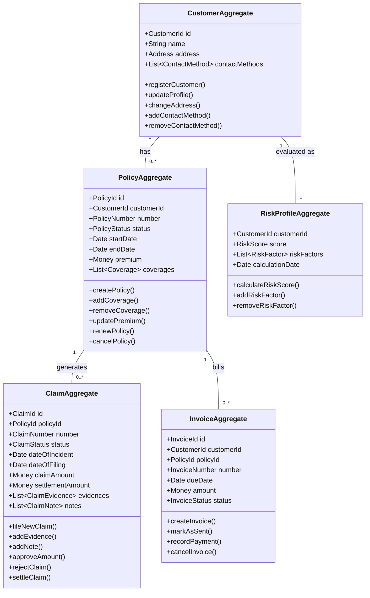

# Lakeside Mutual Aggregates

In Domain-Driven Design, aggregates are clusters of domain objects that are treated as a single unit for data changes. Each aggregate has a root entity through which all changes must occur.

## Aggregate Map

## Aggregate Descriptions

### Customer Aggregate
The Customer Aggregate manages all customer-related information and serves as the core entity for customer management.

**Entities:**
- Customer (Root)
- Address
- ContactMethod

**Value Objects:**
- CustomerId
- CustomerName
- Email
- PhoneNumber

**Invariants:**
- Customer must have at least one contact method
- Email addresses must be unique in the system

### Policy Aggregate
The Policy Aggregate encapsulates all information about an insurance policy and its coverages.

**Entities:**
- Policy (Root)
- Coverage

**Value Objects:**
- PolicyId
- PolicyNumber
- Premium
- CoverageAmount

**Invariants:**
- Policy must have at least one coverage
- Policy end date must be after start date
- Premium must be greater than zero

### Claim Aggregate
The Claim Aggregate handles the information and lifecycle of an insurance claim.

**Entities:**
- Claim (Root)
- ClaimEvidence
- ClaimNote

**Value Objects:**
- ClaimId
- ClaimNumber
- ClaimAmount
- SettlementAmount

**Invariants:**
- Claim must be associated with an active policy
- Settlement amount cannot exceed claim amount
- Claim cannot be settled without approval

### Invoice Aggregate
The Invoice Aggregate manages billing information and payment tracking.

**Entities:**
- Invoice (Root)
- PaymentRecord

**Value Objects:**
- InvoiceId
- InvoiceNumber
- DueAmount

**Invariants:**
- Invoice must be associated with a customer and policy
- Payment amount must match invoice amount for completion

### Risk Profile Aggregate
The Risk Profile Aggregate evaluates and stores risk information for a customer.

**Entities:**
- RiskProfile (Root)
- RiskFactor

**Value Objects:**
- RiskScore
- FactorWeight

**Invariants:**
- Risk score must be recalculated when risk factors change
- Risk profile must be associated with a customer
