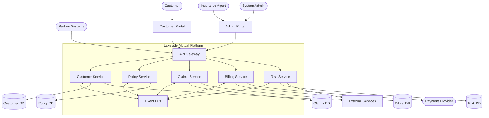
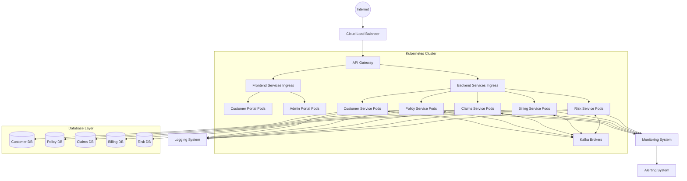

# Lakeside Mutual Architecture Overview

This document provides a high-level overview of the Lakeside Mutual technical architecture. It serves as a starting point for understanding how the system is built and how the components interact.

## System Context

## Architecture Principles

1. **Domain-Driven Design**: The architecture is structured around business domains, with bounded contexts defining clear boundaries.

2. **Microservices Architecture**: Each bounded context is implemented as a microservice with its own database and API.

3. **Event-Driven Communication**: Services communicate via events when sharing information across bounded contexts.

4. **API First**: All services expose well-defined APIs for synchronous communication.

5. **Polyglot Persistence**: Each service uses the most appropriate database technology for its needs.

6. **Cloud-Native**: The system is designed to run in containerized environments with horizontal scaling.

7. **Security by Design**: Security is built into all architectural layers from the beginning.

## Component Architecture

### API Gateway
- Routes requests to appropriate microservices
- Handles authentication and authorization
- Implements rate limiting and request throttling
- Manages API versioning

### Microservices
Each bounded context is implemented as a separate microservice:

1. **Customer Service**
   - Manages customer profiles and identities
   - Handles communication preferences
   - Provides customer search capabilities

2. **Policy Service**
   - Manages policy creation and lifecycle
   - Handles product catalog and coverage options
   - Processes policy changes and renewals

3. **Claims Service**
   - Processes claim submissions
   - Facilitates claim assessment and approval
   - Manages claim settlement

4. **Billing Service**
   - Generates invoices
   - Processes payments
   - Manages billing schedules

5. **Risk Service**
   - Evaluates customer risk
   - Handles risk factor analysis
   - Provides premium calculation

### Event Bus
- Facilitates asynchronous communication between services
- Ensures eventual consistency across bounded contexts
- Supports event sourcing for critical business events

## Technology Stack

### Backend
- Java 17
- Spring Boot
- Spring Cloud
- PostgreSQL / MongoDB (per service needs)
- Apache Kafka (event bus)
- Redis (caching)
- Elasticsearch (searching)

### Frontend
- TypeScript
- React
- Redux
- Material UI

### DevOps
- Docker
- Kubernetes
- Helm Charts
- Prometheus & Grafana
- ELK Stack (logging)
- GitHub Actions (CI/CD)

## Deployment Architecture

## Cross-Cutting Concerns

### Security
- OAuth2/OIDC for authentication
- Role-Based Access Control (RBAC)
- API security (TLS, input validation)
- Data protection and encryption

### Observability
- Distributed tracing (Jaeger/Zipkin)
- Centralized logging (ELK Stack)
- Metrics collection (Prometheus)
- Health monitoring and alerting

### Resilience
- Circuit breakers
- Bulkheads
- Rate limiting
- Retry policies
- Fallback mechanisms

### Performance
- Caching strategies
- Database optimization
- Efficient API design
- Resource scaling

## References
- [Bounded Contexts Documentation](../bounded-contexts.md)
- [Domain Events Documentation](../domain-events.md)
- [Architecture Decision Records](./)
