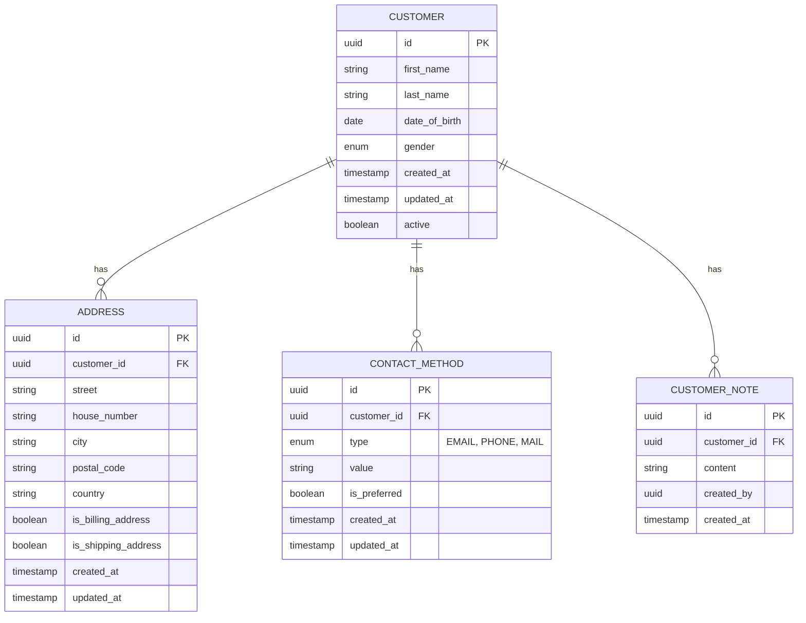
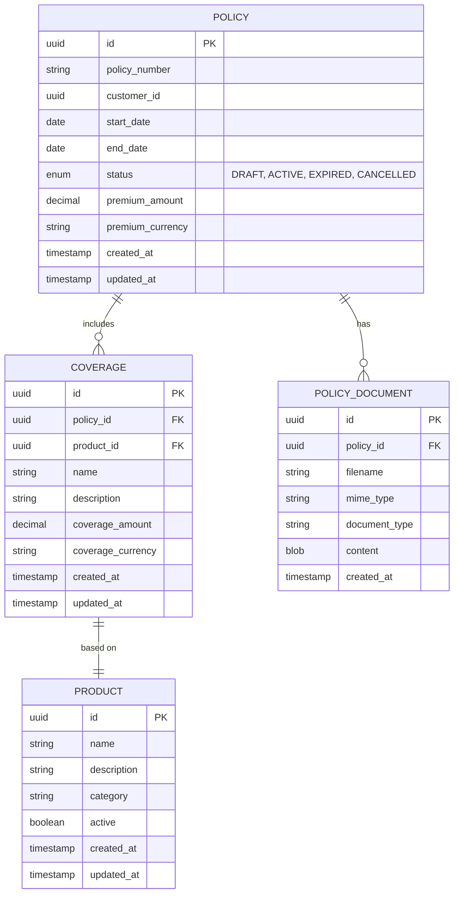
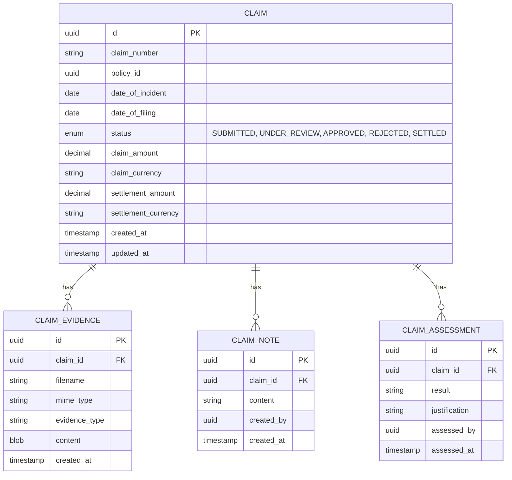
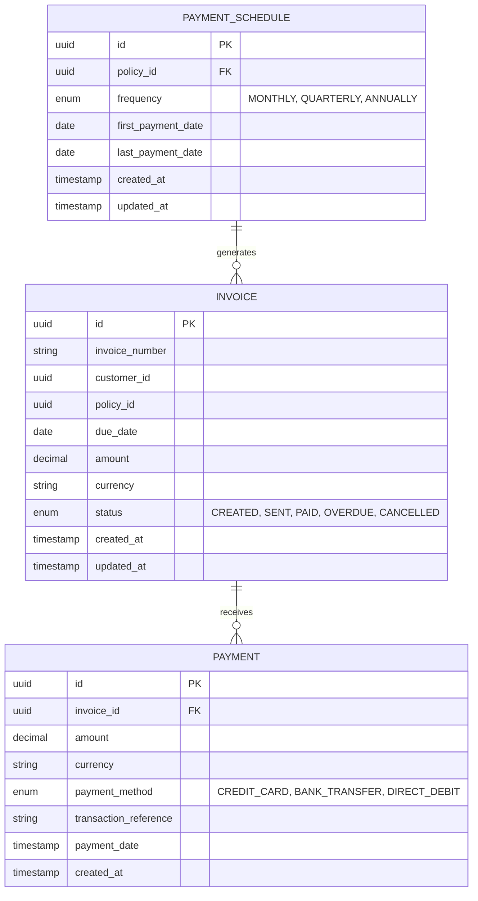
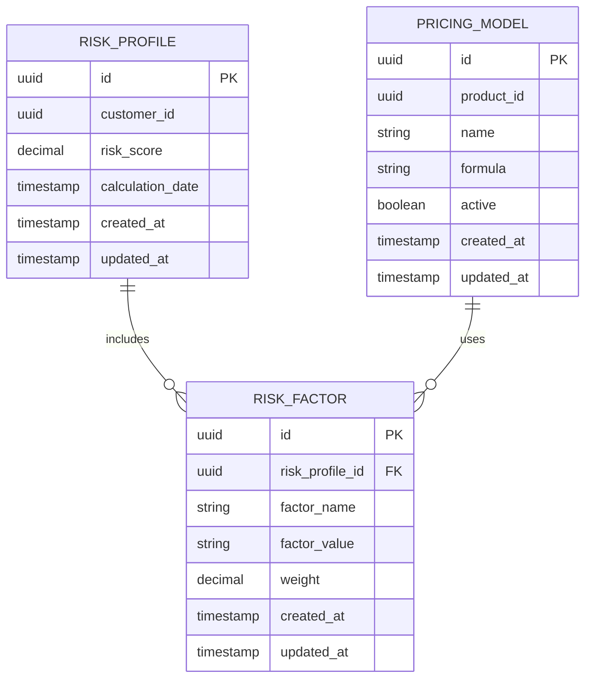
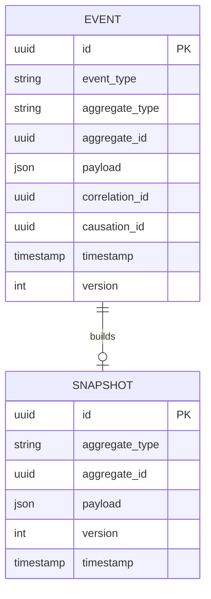

# Database Schema Design

This document provides the database schema design for each bounded context in the Lakeside Mutual application. The schemas are designed following domain-driven design principles, with each bounded context having its own database.

## Customer Management Context

## Policy Management Context

## Claims Processing Context

## Billing Context

## Risk Assessment Context

## Event Store

To support the event-driven architecture, we also maintain an event store:

## Notes on Database Selection

Each bounded context can use the most appropriate database technology:

1. **Customer Management** - PostgreSQL (relational data with complex queries)
2. **Policy Management** - PostgreSQL (relational data with transaction support)
3. **Claims Processing** - PostgreSQL + MongoDB (structured data + document storage for evidence)
4. **Billing** - PostgreSQL (financial transactions require ACID properties)
5. **Risk Assessment** - PostgreSQL + Redis (for complex calculations and caching)
6. **Event Store** - EventStoreDB (specialized for event sourcing)
