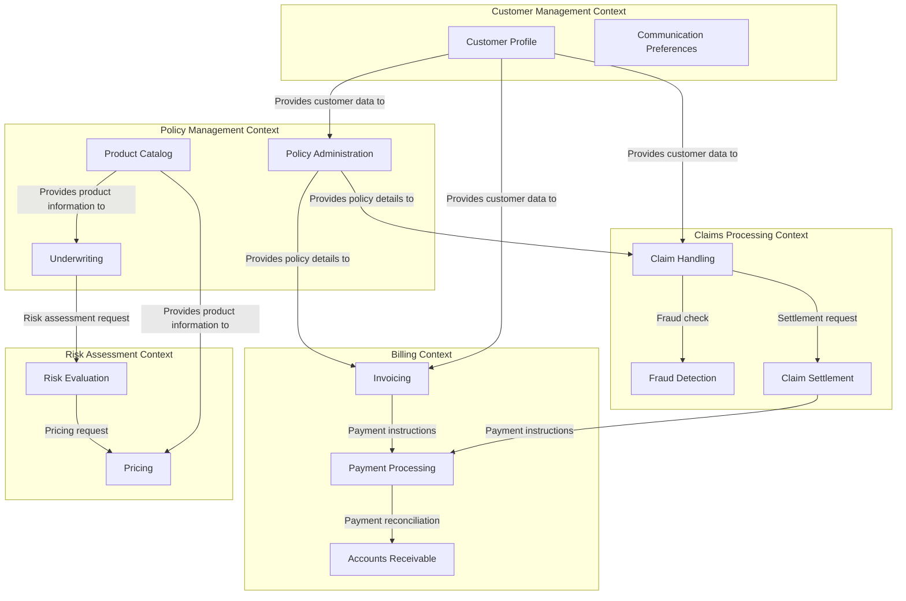

# Lakeside Mutual Bounded Contexts

Bounded Contexts represent distinct areas of the domain with clear boundaries. Each bounded context has its own ubiquitous language, models, and implementations.

## Bounded Context Map

## Bounded Context Descriptions

### Customer Management Context
Responsible for managing all customer-related information, including personal details, contact information, communication preferences, and customer interactions.

**Key Concepts:**
- Customer Profile
- Communication Preferences
- Customer Interactions
- Customer Documents

### Policy Management Context
Manages the entire lifecycle of insurance policies, from quotation to termination.

**Key Concepts:**
- Policy
- Coverage
- Underwriting
- Product Catalog
- Policy Documents

### Claims Processing Context
Handles all aspects of processing insurance claims, from initial reporting to settlement.

**Key Concepts:**
- Claim
- Claim Assessment
- Fraud Detection
- Settlement
- Claim Documents

### Billing Context
Manages all financial aspects related to insurance policies.

**Key Concepts:**
- Invoice
- Payment
- Premium Calculation
- Account Balance
- Payment Schedule

### Risk Assessment Context
Evaluates risks associated with policies and determines appropriate pricing.

**Key Concepts:**
- Risk Factor
- Risk Score
- Pricing Model
- Actuarial Data

## Context Mapping Patterns

The interactions between bounded contexts follow these DDD context mapping patterns:

1. **Customer Management → Policy Management**: Partnership relation
2. **Customer Management → Claims Processing**: Customer/Supplier relationship
3. **Policy Management → Claims Processing**: Conformist relationship
4. **Policy Management → Billing**: Customer/Supplier relationship
5. **Claims Processing → Billing**: Customer/Supplier relationship
