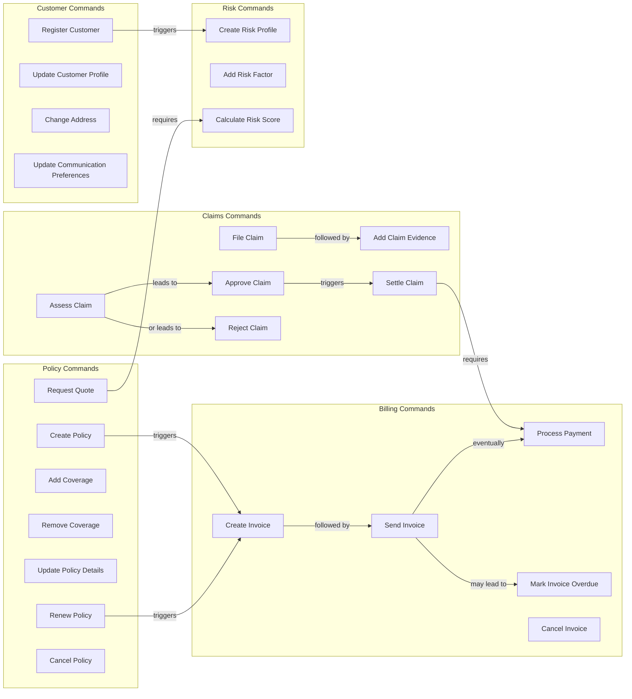

# Lakeside Mutual Commands

Commands represent user intentions and are used to change the state of the system. Unlike events which describe something that has happened, commands express what a user wants to do.

## Commands Flow

## Command Descriptions

### Customer Commands

1. **RegisterCustomer**
   - **Purpose**: Register a new customer in the system
   - **Parameters**: Name, Address, ContactInformation
   - **Preconditions**: None
   - **Success Outcome**: Customer registered and assigned a unique ID
   - **Failure Outcomes**: Validation errors in provided information

2. **UpdateCustomerProfile**
   - **Purpose**: Modify existing customer information
   - **Parameters**: CustomerId, Field updates
   - **Preconditions**: Customer must exist
   - **Success Outcome**: Customer profile updated
   - **Failure Outcomes**: Customer not found, validation errors

3. **ChangeAddress**
   - **Purpose**: Update a customer's address
   - **Parameters**: CustomerId, NewAddress
   - **Preconditions**: Customer must exist
   - **Success Outcome**: Address updated
   - **Failure Outcomes**: Customer not found, invalid address

4. **UpdateCommunicationPreferences**
   - **Purpose**: Change how the customer prefers to be contacted
   - **Parameters**: CustomerId, PreferredChannels
   - **Preconditions**: Customer must exist
   - **Success Outcome**: Communication preferences updated
   - **Failure Outcomes**: Customer not found, invalid preferences

### Policy Commands

1. **RequestQuote**
   - **Purpose**: Request an insurance quote
   - **Parameters**: CustomerId, ProductType, CoverageRequirements
   - **Preconditions**: Customer must exist
   - **Success Outcome**: Quote generated
   - **Failure Outcomes**: Customer not found, product not available

2. **CreatePolicy**
   - **Purpose**: Create a new insurance policy
   - **Parameters**: QuoteId, CustomerId
   - **Preconditions**: Valid quote must exist
   - **Success Outcome**: Policy created
   - **Failure Outcomes**: Quote expired, validation errors

3. **AddCoverage**
   - **Purpose**: Add coverage to an existing policy
   - **Parameters**: PolicyId, CoverageType, CoverageAmount
   - **Preconditions**: Policy must exist and be active
   - **Success Outcome**: Coverage added
   - **Failure Outcomes**: Policy not found, invalid coverage type

4. **RemoveCoverage**
   - **Purpose**: Remove coverage from an existing policy
   - **Parameters**: PolicyId, CoverageId
   - **Preconditions**: Policy must exist, coverage must exist
   - **Success Outcome**: Coverage removed
   - **Failure Outcomes**: Policy not found, coverage not found

5. **UpdatePolicyDetails**
   - **Purpose**: Modify policy information
   - **Parameters**: PolicyId, Details to update
   - **Preconditions**: Policy must exist
   - **Success Outcome**: Policy updated
   - **Failure Outcomes**: Policy not found, validation errors

6. **RenewPolicy**
   - **Purpose**: Renew an expiring policy
   - **Parameters**: PolicyId, NewTerm
   - **Preconditions**: Policy must exist and be active or soon expiring
   - **Success Outcome**: Policy renewed with new term
   - **Failure Outcomes**: Policy not found, policy not eligible for renewal

7. **CancelPolicy**
   - **Purpose**: Cancel an active policy
   - **Parameters**: PolicyId, Reason, EffectiveDate
   - **Preconditions**: Policy must exist and be active
   - **Success Outcome**: Policy canceled
   - **Failure Outcomes**: Policy not found, already canceled

### Claims Commands

1. **FileClaim**
   - **Purpose**: Submit a new insurance claim
   - **Parameters**: PolicyId, IncidentDetails, ClaimAmount
   - **Preconditions**: Valid policy must exist
   - **Success Outcome**: Claim created and assigned claim number
   - **Failure Outcomes**: Policy not found, policy not active

2. **AddClaimEvidence**
   - **Purpose**: Attach supporting documentation to a claim
   - **Parameters**: ClaimId, EvidenceDetails
   - **Preconditions**: Claim must exist
   - **Success Outcome**: Evidence added to claim
   - **Failure Outcomes**: Claim not found

3. **AssessClaim**
   - **Purpose**: Evaluate a submitted claim
   - **Parameters**: ClaimId, AssessmentNotes
   - **Preconditions**: Claim must exist and be in submitted state
   - **Success Outcome**: Claim assessment complete
   - **Failure Outcomes**: Claim not found, invalid state transition

4. **ApproveClaim**
   - **Purpose**: Approve a claim for payment
   - **Parameters**: ClaimId, ApprovedAmount
   - **Preconditions**: Claim must be assessed
   - **Success Outcome**: Claim approved
   - **Failure Outcomes**: Claim not found, invalid state transition

5. **RejectClaim**
   - **Purpose**: Deny a claim
   - **Parameters**: ClaimId, RejectionReason
   - **Preconditions**: Claim must be assessed
   - **Success Outcome**: Claim rejected
   - **Failure Outcomes**: Claim not found, invalid state transition

6. **SettleClaim**
   - **Purpose**: Process payment for an approved claim
   - **Parameters**: ClaimId, PaymentDetails
   - **Preconditions**: Claim must be approved
   - **Success Outcome**: Claim settled and payment processed
   - **Failure Outcomes**: Claim not found, payment processing error

### Billing Commands

1. **CreateInvoice**
   - **Purpose**: Generate an invoice for a policy
   - **Parameters**: PolicyId, BillingPeriod
   - **Preconditions**: Policy must exist and be active
   - **Success Outcome**: Invoice created
   - **Failure Outcomes**: Policy not found

2. **SendInvoice**
   - **Purpose**: Dispatch invoice to customer
   - **Parameters**: InvoiceId, DeliveryMethod
   - **Preconditions**: Invoice must exist
   - **Success Outcome**: Invoice sent to customer
   - **Failure Outcomes**: Invoice not found, delivery error

3. **ProcessPayment**
   - **Purpose**: Record payment for an invoice
   - **Parameters**: InvoiceId, PaymentAmount, PaymentMethod
   - **Preconditions**: Invoice must exist
   - **Success Outcome**: Payment recorded
   - **Failure Outcomes**: Invoice not found, payment processing error

4. **MarkInvoiceOverdue**
   - **Purpose**: Flag invoice as past due
   - **Parameters**: InvoiceId
   - **Preconditions**: Invoice must exist and be unpaid past due date
   - **Success Outcome**: Invoice marked as overdue
   - **Failure Outcomes**: Invoice not found, not eligible for overdue status

5. **CancelInvoice**
   - **Purpose**: Cancel an unpaid invoice
   - **Parameters**: InvoiceId, Reason
   - **Preconditions**: Invoice must exist and be unpaid
   - **Success Outcome**: Invoice canceled
   - **Failure Outcomes**: Invoice not found, already paid

### Risk Commands

1. **CreateRiskProfile**
   - **Purpose**: Create a new risk profile for a customer
   - **Parameters**: CustomerId
   - **Preconditions**: Customer must exist
   - **Success Outcome**: Risk profile created
   - **Failure Outcomes**: Customer not found

2. **AddRiskFactor**
   - **Purpose**: Add a risk factor to a customer's profile
   - **Parameters**: CustomerId, RiskFactorType, RiskFactorValue
   - **Preconditions**: Risk profile must exist
   - **Success Outcome**: Risk factor added
   - **Failure Outcomes**: Risk profile not found

3. **CalculateRiskScore**
   - **Purpose**: Compute risk score based on profile factors
   - **Parameters**: CustomerId
   - **Preconditions**: Risk profile must exist with at least one factor
   - **Success Outcome**: Risk score calculated
   - **Failure Outcomes**: Risk profile not found
