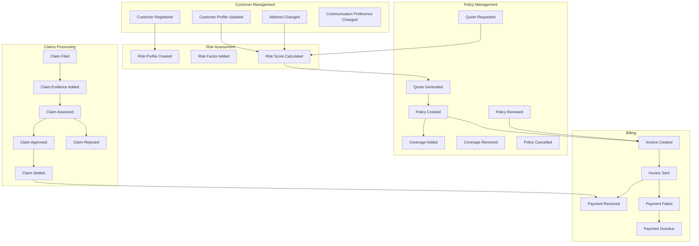

# Lakeside Mutual Domain Events

Domain events represent significant occurrences within the domain. They are immutable and represent something that has happened in the past.

## Domain Events Flow

## Domain Event Descriptions

### Customer Management Events

1. **CustomerRegistered**
   - **Description**: Fired when a new customer completes registration
   - **Payload**: CustomerId, Name, Address, ContactInformation
   - **Consumers**: Policy Management, Risk Assessment
   
2. **CustomerProfileUpdated**
   - **Description**: Fired when customer details are modified
   - **Payload**: CustomerId, Updated Fields
   - **Consumers**: Policy Management, Billing
   
3. **AddressChanged**
   - **Description**: Fired when a customer's address is updated
   - **Payload**: CustomerId, OldAddress, NewAddress
   - **Consumers**: Policy Management, Billing, Risk Assessment
   
4. **CommunicationPreferenceChanged**
   - **Description**: Fired when customer changes preferred communication method
   - **Payload**: CustomerId, OldPreference, NewPreference
   - **Consumers**: All contexts

### Policy Management Events

1. **QuoteRequested**
   - **Description**: Fired when a customer requests an insurance quote
   - **Payload**: QuoteId, CustomerId, ProductType, CoverageRequirements
   - **Consumers**: Risk Assessment
   
2. **QuoteGenerated**
   - **Description**: Fired when quote calculation is complete
   - **Payload**: QuoteId, Premium, Coverages, Validity Period
   - **Consumers**: Customer Management
   
3. **PolicyCreated**
   - **Description**: Fired when a new policy is created from a quote
   - **Payload**: PolicyId, CustomerId, PolicyDetails
   - **Consumers**: Billing, Customer Management
   
4. **CoverageAdded**
   - **Description**: Fired when coverage is added to a policy
   - **Payload**: PolicyId, CoverageDetails
   - **Consumers**: Billing
   
5. **CoverageRemoved**
   - **Description**: Fired when coverage is removed from a policy
   - **Payload**: PolicyId, CoverageId
   - **Consumers**: Billing
   
6. **PolicyRenewed**
   - **Description**: Fired when a policy is renewed
   - **Payload**: PolicyId, NewStartDate, NewEndDate
   - **Consumers**: Billing, Customer Management
   
7. **PolicyCancelled**
   - **Description**: Fired when a policy is canceled
   - **Payload**: PolicyId, CancellationReason, EffectiveDate
   - **Consumers**: Billing, Customer Management

### Claims Processing Events

1. **ClaimFiled**
   - **Description**: Fired when a new claim is submitted
   - **Payload**: ClaimId, PolicyId, IncidentDetails, ClaimAmount
   - **Consumers**: Policy Management
   
2. **ClaimEvidenceAdded**
   - **Description**: Fired when supporting documentation is added to a claim
   - **Payload**: ClaimId, EvidenceDetails
   - **Consumers**: Internal only
   
3. **ClaimAssessed**
   - **Description**: Fired when a claim has been evaluated
   - **Payload**: ClaimId, AssessmentDetails
   - **Consumers**: Internal only
   
4. **ClaimApproved**
   - **Description**: Fired when a claim is approved
   - **Payload**: ClaimId, ApprovedAmount
   - **Consumers**: Customer Management, Billing
   
5. **ClaimRejected**
   - **Description**: Fired when a claim is denied
   - **Payload**: ClaimId, RejectionReason
   - **Consumers**: Customer Management
   
6. **ClaimSettled**
   - **Description**: Fired when a claim payment is processed
   - **Payload**: ClaimId, SettlementAmount, PaymentMethod
   - **Consumers**: Billing, Customer Management

### Billing Events

1. **InvoiceCreated**
   - **Description**: Fired when a new invoice is generated
   - **Payload**: InvoiceId, CustomerId, PolicyId, Amount, DueDate
   - **Consumers**: Customer Management
   
2. **InvoiceSent**
   - **Description**: Fired when an invoice is sent to the customer
   - **Payload**: InvoiceId, SentDate, DeliveryMethod
   - **Consumers**: Customer Management
   
3. **PaymentReceived**
   - **Description**: Fired when payment is successfully processed
   - **Payload**: InvoiceId, PaymentAmount, PaymentDate, PaymentMethod
   - **Consumers**: Policy Management, Customer Management
   
4. **PaymentFailed**
   - **Description**: Fired when a payment attempt fails
   - **Payload**: InvoiceId, FailureReason
   - **Consumers**: Customer Management
   
5. **PaymentOverdue**
   - **Description**: Fired when an invoice is not paid by the due date
   - **Payload**: InvoiceId, DaysOverdue
   - **Consumers**: Policy Management, Customer Management

### Risk Assessment Events

1. **RiskProfileCreated**
   - **Description**: Fired when a risk profile is generated for a customer
   - **Payload**: CustomerId, InitialRiskScore
   - **Consumers**: Policy Management
   
2. **RiskFactorAdded**
   - **Description**: Fired when a new risk factor is identified
   - **Payload**: CustomerId, RiskFactorType, RiskFactorValue
   - **Consumers**: Policy Management
   
3. **RiskScoreCalculated**
   - **Description**: Fired when a customer's risk score is updated
   - **Payload**: CustomerId, OldScore, NewScore, ReasonForChange
   - **Consumers**: Policy Management, Underwriting
