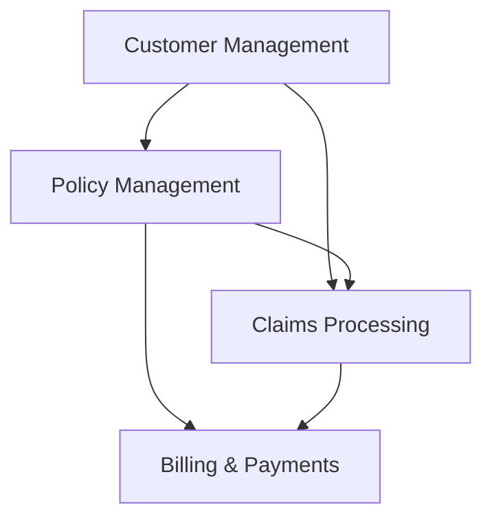
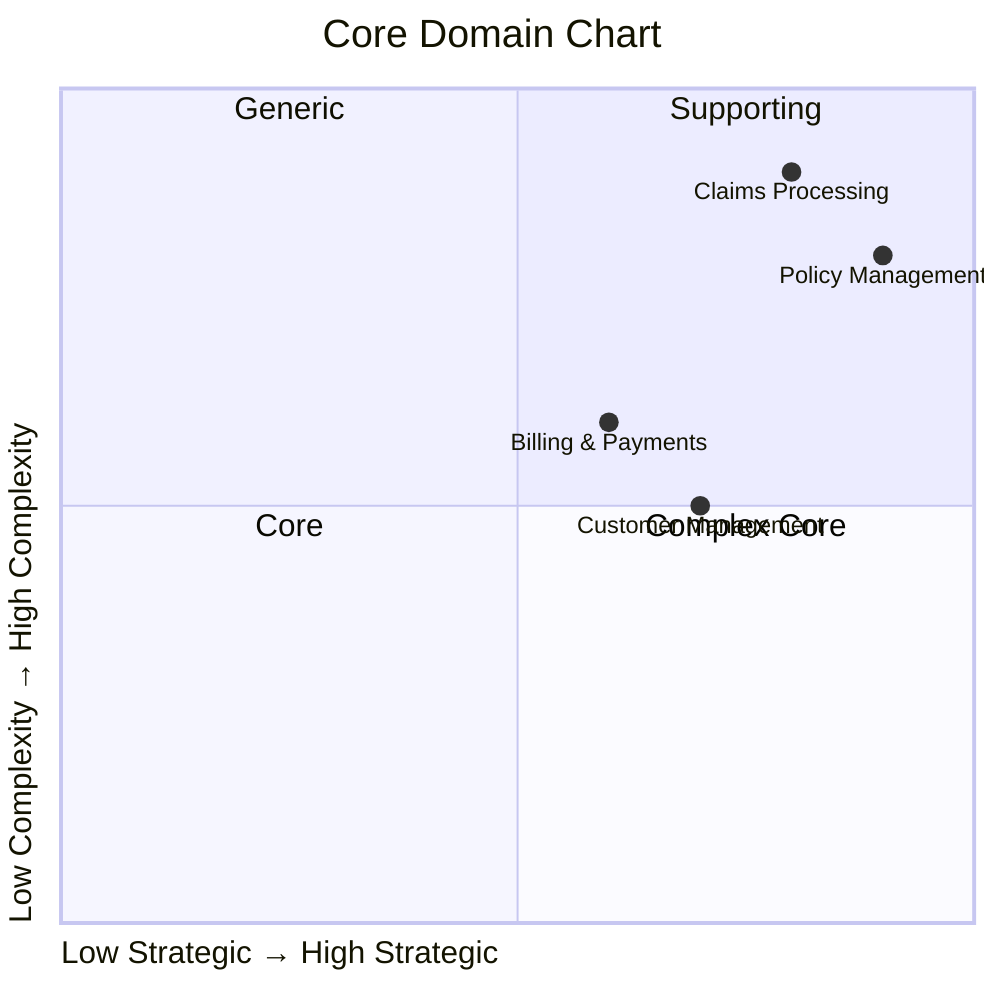

# Lakeside Mutual Domain Overview

Lakeside Mutual is an insurance company that handles policies, customer management, and claims processing. This document provides an overview of the domain model derived from the Event Storming session.

## High-Level Domain Model

## Core Business Capabilities

1. **Customer Management**
   - Customer registration and onboarding
   - Profile updates and management
   - Communication preferences

2. **Policy Management**
   - Policy creation and quotes
   - Policy updates and renewals
   - Coverage management

3. **Claims Processing**
   - Claim submission
   - Claim assessment
   - Claim settlement

4. **Billing & Payments**
   - Premium calculations
   - Payment processing
   - Invoice generation

## Strategic Domain Classification

Using the Core Domain Chart approach:

The core domains of Lakeside Mutual are Policy Management and Claims Processing, which represent the highest strategic value and complexity.
