# Lakeside Mutual Policies

Policies in Domain-Driven Design represent business rules that act upon events. They automate decisions and processes based on business conditions.

## Business Policies Overview

```mermaid
flowchart TD
    subgraph "Customer Policies"
        CustomerRegistered[Customer Registered] --> VerifyIdentity[Verify Identity]
        CustomerRegistered --> AssignCustomerCategory[Assign Customer Category]
        AddressChanged[Address Changed] --> UpdateServiceArea[Update Service Area]
    end
    
    subgraph "Policy Policies"
        PolicyCreated[Policy Created] --> ScheduleRenewalReminder[Schedule Renewal Reminder]
        PolicyRenewed[Policy Renewed] --> UpdateRenewalHistory[Update Renewal History]
        PolicyCancelled[Policy Cancelled] --> ProcessRefund[Process Refund]
    end
    
    subgraph "Claims Policies"
        ClaimFiled[Claim Filed] --> FraudCheck[Perform Fraud Check]
        ClaimFiled --> AssignClaimHandler[Assign Claim Handler]
        ClaimApproved[Claim Approved] --> SchedulePayment[Schedule Payment]
        ClaimRejected[Claim Rejected] --> NotifyCustomer[Notify Customer]
    end
    
    subgraph "Billing Policies"
        InvoiceCreated[Invoice Created] --> ScheduleReminders[Schedule Payment Reminders]
        PaymentReceived[Payment Received] --> IssueReceipt[Issue Receipt]
        PaymentFailed[Payment Failed] --> RetryPayment[Retry Payment]
        PaymentOverdue[Payment Overdue] --> ApplyLateFee[Apply Late Fee]
    end
    
    subgraph "Risk Policies"
        RiskScoreCalculated[Risk Score Calculated] --> AdjustPremium[Adjust Premium]
        RiskScoreCalculated --> EvaluatePolicy[Evaluate Policy Eligibility]
        RiskFactorAdded[Risk Factor Added] --> RecalculateRiskScore[Recalculate Risk Score]
    end
```

## Policy Descriptions

### Customer Policies

1. **Verify Identity Policy**
   - **Trigger**: CustomerRegistered event
   - **Action**: Initiate identity verification process
   - **Description**: When a new customer registers, the system automatically requests identity verification documents based on the customer's country and risk profile.
   - **Business Rule**: High-risk regions require additional verification steps

2. **Assign Customer Category Policy**
   - **Trigger**: CustomerRegistered event
   - **Action**: Categorize customer based on profile information
   - **Description**: Each new customer is automatically assigned to a category (Standard, Premium, VIP) based on initial information provided.
   - **Business Rule**: Categories determine service levels and available products

3. **Update Service Area Policy**
   - **Trigger**: AddressChanged event
   - **Action**: Update applicable service area and coverage options
   - **Description**: When a customer's address changes, the system updates the service area and available coverage options based on the new location.
   - **Business Rule**: Some coverage types are region-specific

### Policy Policies

1. **Schedule Renewal Reminder Policy**
   - **Trigger**: PolicyCreated event
   - **Action**: Create reminders for renewal dates
   - **Description**: When a policy is created, the system schedules reminders to notify the customer before the policy expires.
   - **Business Rule**: First reminder at 60 days, second at 30 days, final at 15 days before expiration

2. **Update Renewal History Policy**
   - **Trigger**: PolicyRenewed event
   - **Action**: Record renewal information for customer loyalty programs
   - **Description**: Each time a policy is renewed, the system updates the customer's loyalty status.
   - **Business Rule**: Multiple consecutive renewals qualify customers for loyalty discounts

3. **Process Refund Policy**
   - **Trigger**: PolicyCancelled event
   - **Action**: Calculate and issue refund if applicable
   - **Description**: When a policy is canceled, the system automatically calculates any refund amount based on policy terms and time remaining.
   - **Business Rule**: Full refund for cancellation within 30 days, prorated thereafter

### Claims Policies

1. **Perform Fraud Check Policy**
   - **Trigger**: ClaimFiled event
   - **Action**: Run automated fraud detection algorithms
   - **Description**: When a claim is filed, the system automatically performs a series of fraud detection checks.
   - **Business Rule**: Claims exceeding certain thresholds or matching fraud patterns are flagged for manual review

2. **Assign Claim Handler Policy**
   - **Trigger**: ClaimFiled event
   - **Action**: Assign appropriate claim handler based on claim type
   - **Description**: New claims are automatically routed to the appropriate claim handler based on claim type, complexity, and current workload.
   - **Business Rule**: Specialized handlers are assigned based on claim category and value

3. **Schedule Payment Policy**
   - **Trigger**: ClaimApproved event
   - **Action**: Schedule payment based on settlement terms
   - **Description**: When a claim is approved, the system automatically schedules payment according to the agreed terms.
   - **Business Rule**: Payments over a threshold require additional approval

4. **Notify Customer Policy**
   - **Trigger**: ClaimRejected event
   - **Action**: Send detailed explanation to customer
   - **Description**: When a claim is rejected, the system automatically generates a detailed explanation for the customer.
   - **Business Rule**: All rejection notifications must include appeal process information

### Billing Policies

1. **Schedule Payment Reminders Policy**
   - **Trigger**: InvoiceCreated event
   - **Action**: Create schedule for payment reminders
   - **Description**: When an invoice is created, the system schedules a series of payment reminders based on the due date.
   - **Business Rule**: Reminders at 7 days before due date, on due date, and 7 days after due date

2. **Issue Receipt Policy**
   - **Trigger**: PaymentReceived event
   - **Action**: Generate and send payment receipt
   - **Description**: When payment is received, the system automatically generates and sends a receipt to the customer.
   - **Business Rule**: Receipts must include payment details and remaining balance if applicable

3. **Retry Payment Policy**
   - **Trigger**: PaymentFailed event
   - **Action**: Schedule automatic retry of payment
   - **Description**: When a payment fails, the system automatically schedules retry attempts at defined intervals.
   - **Business Rule**: Three retry attempts at 3-day intervals before marking as payment overdue

4. **Apply Late Fee Policy**
   - **Trigger**: PaymentOverdue event
   - **Action**: Calculate and add late payment fee
   - **Description**: When a payment becomes overdue, the system automatically applies late fees according to the terms.
   - **Business Rule**: Late fee is 5% of outstanding amount after 14 days overdue

### Risk Policies

1. **Adjust Premium Policy**
   - **Trigger**: RiskScoreCalculated event
   - **Action**: Recalculate premium based on new risk score
   - **Description**: When a risk score changes, the system automatically recalculates premium amounts for affected policies.
   - **Business Rule**: Premium adjustments applied at next renewal for existing policies

2. **Evaluate Policy Eligibility Policy**
   - **Trigger**: RiskScoreCalculated event
   - **Action**: Determine eligibility for different policy types
   - **Description**: Based on risk score changes, the system evaluates customer eligibility for different policy types.
   - **Business Rule**: Risk scores above certain thresholds may limit policy options

3. **Recalculate Risk Score Policy**
   - **Trigger**: RiskFactorAdded event
   - **Action**: Trigger risk score recalculation
   - **Description**: When a new risk factor is added, the system automatically recalculates the overall risk score.
   - **Business Rule**: Some risk factors carry more weight based on actuarial data
