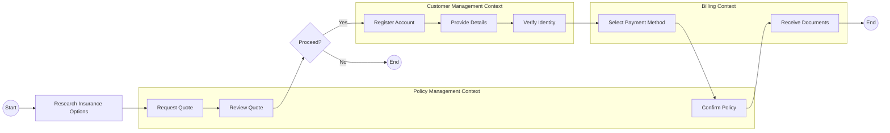
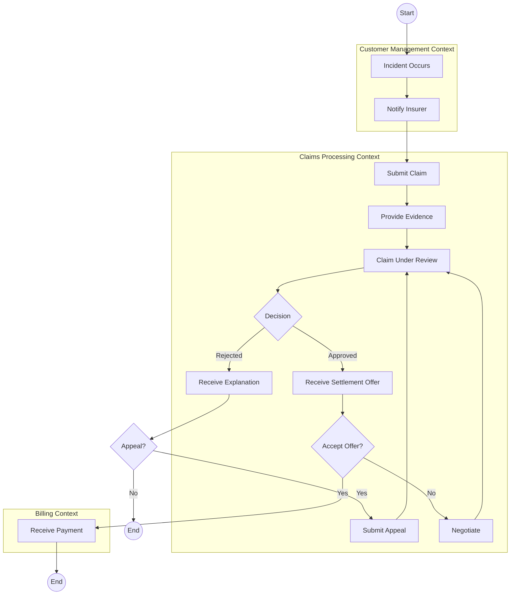
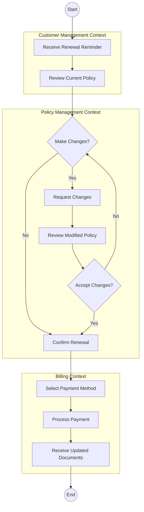

# Lakeside Mutual User Journeys

User journeys map the path users take when interacting with the system, highlighting the touchpoints and experiences across different bounded contexts.

## Customer Onboarding Journey

## Claims Processing Journey

## Policy Renewal Journey

## Journey Touchpoints Analysis

Each user journey crosses multiple bounded contexts, demonstrating how the contexts need to collaborate to deliver a cohesive user experience.

### Customer Onboarding Journey Touchpoints

| Touchpoint | Bounded Context | Events Generated | Commands Processed |
|------------|-----------------|------------------|-------------------|
| Research Insurance Options | External | None | None |
| Request Quote | Policy Management | QuoteRequested | RequestQuote |
| Review Quote | Policy Management | QuoteGenerated | None |
| Register Account | Customer Management | CustomerRegistered | RegisterCustomer |
| Provide Details | Customer Management | CustomerProfileUpdated | UpdateCustomerProfile |
| Verify Identity | Customer Management | CustomerVerified | VerifyCustomer |
| Select Payment Method | Billing | PaymentMethodAdded | AddPaymentMethod |
| Confirm Policy | Policy Management | PolicyCreated | CreatePolicy |
| Receive Documents | Billing | InvoiceCreated, DocumentsGenerated | None |

### Claims Processing Journey Touchpoints

| Touchpoint | Bounded Context | Events Generated | Commands Processed |
|------------|-----------------|------------------|-------------------|
| Incident Occurs | External | None | None |
| Notify Insurer | Customer Management | CustomerContactRecorded | RecordCustomerContact |
| Submit Claim | Claims Processing | ClaimFiled | FileClaim |
| Provide Evidence | Claims Processing | ClaimEvidenceAdded | AddClaimEvidence |
| Claim Under Review | Claims Processing | ClaimAssessed | AssessClaim |
| Receive Settlement Offer | Claims Processing | ClaimApproved | ApproveClaim |
| Receive Explanation | Claims Processing | ClaimRejected | RejectClaim |
| Submit Appeal | Claims Processing | ClaimAppealFiled | FileClaimAppeal |
| Receive Payment | Billing | PaymentProcessed | ProcessPayment |

### Policy Renewal Journey Touchpoints

| Touchpoint | Bounded Context | Events Generated | Commands Processed |
|------------|-----------------|------------------|-------------------|
| Receive Renewal Reminder | Customer Management | RenewalReminderSent | SendRenewalReminder |
| Review Current Policy | Customer Management | None | None |
| Request Changes | Policy Management | PolicyChangeRequested | RequestPolicyChange |
| Review Modified Policy | Policy Management | PolicyModified | None |
| Confirm Renewal | Policy Management | PolicyRenewed | RenewPolicy |
| Select Payment Method | Billing | PaymentMethodSelected | SelectPaymentMethod |
| Process Payment | Billing | PaymentReceived | ProcessPayment |
| Receive Updated Documents | Billing | DocumentsGenerated | GenerateDocuments |
